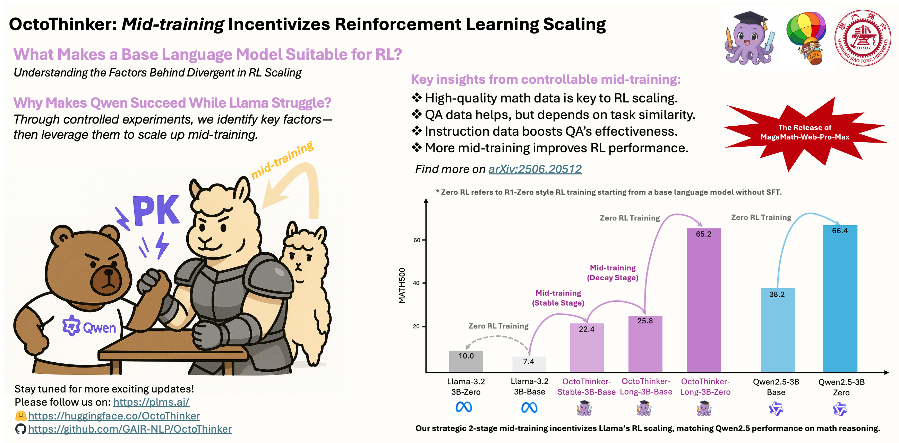

<div align="center">
<h1>🐙 OctoThinker<br>
Mid-training Incentivizes Reinforcement Learning Scaling
</h1>
</div>
<div align="center">

[](https://arxiv.org/abs/2506.20512)
[](https://tinyurl.com/OctoThinker)
[-5f16a8?style=for-the-badge&logo=huggingface&logoColor=white)](https://huggingface.co/OctoThinker)
</div>

> *Revisiting Mid-training in the Era of RL Scaling*

## 🔥 News
- **[2025-06-26]** 🎉🎉🎉 We release our detailed technical report on [**arXiv**](https://arxiv.org/abs/2506.20512) 
and MegaMath-Pro-Max corpus on [**HuggingFace**](https://huggingface.co/datasets/OctoThinker/MegaMath-Web-Pro-Max).
- **[2025-04-24]** 🎉🎉🎉 We release our first progress blog on [**Notion**](https://tinyurl.com/OctoThinker), together with the first version of our base and RL models on [**HuggingFace**](https://huggingface.co/collections/GAIR/octothinker-68035e416813f9833a8060f3), which is trained on Llama-3 series.

## 📖 Introduction




> **Note:** We are still in the process of exploring more possibilities and expand to different model families, but we are eager to share some findings with the community from our empirical results in an open-source manner!

We explores how different early pre(mid)-training strategies' could bring impact to post-training stages, especially during the period of Reinforcement Learning (RL). We hold the hope of reshaping the pre-training stage of LLMs, in the era of RL scaling. **🐙 OctoThinker** is our initial attempt to explore this direction. 
**We go through a thorough pipeline of pre-training, RL, and evaluation, to investigate deep-level insights.**

### What does 🐙 OctoThinker mean?
"Octo" is from the word "octopus", representing our base model families which are branched and trained via different strategies.
"Thinker" means the model is finally trained to think and reason at RL stage, which is expected to show frequent self-reflection behaviors and strong reasoning abilities.

## Usage
Currently, our repo contains 3 main parts:
- Pre-training code based on [Nanotron](https://github.com/huggingface/nanotron)
- RL code based on [verl](https://github.com/volcengine/verl)
- Evaluation code which is refined from [DeepSeekMath](https://github.com/deepseek-ai/deepseek-math) and [MegaMath](https://github.com/LLM360/MegaMath)

### Pre-training

<summary><b>Pre-training Environment Setup</b></summary>
<p>

```bash
conda create -n nanotron python=3.10
conda activate nanotron
cd nanotron
pip install -r requirements.txt
```
</p>

<summary><b>To Submit Pre-training Jobs</b></summary>
<p>

```bash
#TODO: add pre-training scripts
```
</p>

### RL

<summary><b>RL Environment Setup</b></summary>
<p>

```bash
#TODO: add RL scripts
```
</p>

<summary><b>To Submit RL Jobs</b></summary>
<p>

```bash
#TODO: add RL scripts
```
</p>

### Evaluation

<summary><b>Evaluation Environment Setup</b></summary>
<p>

```bash
conda create -n matheval python=3.10
conda activate matheval
cd eval
pip install -r requirements.txt
```
</p>

<summary><b>To Submit Evaluation Jobs</b></summary>
<p>

```bash
cd eval
bash scripts/en_math_cot_eval_last4dir.sh <model_root_dir>
```

</p>


### Visualization
We also provide the visualization code for the pre-training and RL process. All visualizations are in [plot](./plot/) directory to ensure the reproducibility.


## Acknowledgements

For training framework and inference engine, we use [**verl**](https://github.com/volcengine/verl) and  [**vLLM**](https://github.com/vllm-project/vllm). We thank huggingface **[open-r1 team](https://huggingface.co/open-r1)**, [**a-m-team**](https://huggingface.co/a-m-team), and also [**SimpleRL**](https://github.com/hkust-nlp/simpleRL-reason) Project, to open source their dataset and training recipes. In fact, we are deeply grateful to the entire open‑source community for their tireless efforts in making our exploration possible.

If you find this work useful, please cite:

```
@article{wang2025octothinker,
  title={OctoThinker: Mid-training Incentivizes Reinforcement Learning Scaling},
  author={Wang, Zengzhi and Zhou, Fan and Li, Xuefeng and Liu, Pengfei},
  year={2025},
  journal={arXiv preprint arXiv:2506.20512},
  year={2025},
  note={Preprint}
}
```